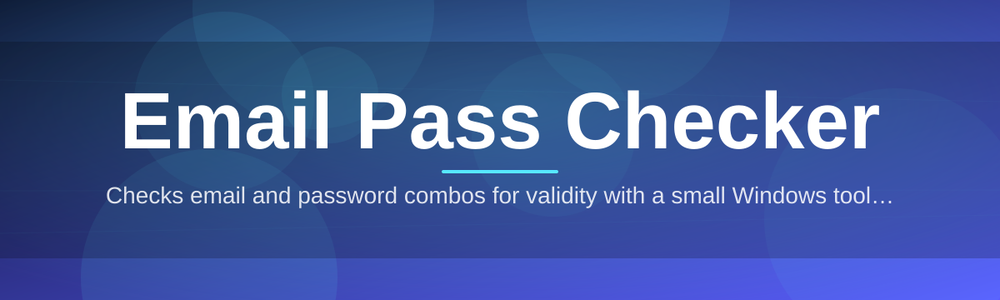
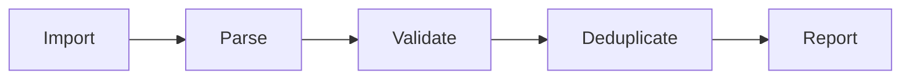

# email-pass-checker-utility 📬🔐

  

*A no-fuss desktop companion for validating email and credential pairs at scale, built for people who'd rather click a button than write a script.*

  

---

## 🚀 Three Steps and You're Checking

**TL;DR: Download it, unzip it, run it — no setup wizard, no dependency chasing.**

1. Grab the latest build from the landing page linked below.
2. Extract the folder anywhere on your machine — Desktop, a USB stick, wherever.
3. Double-click the executable and drop in your list. That's the whole ceremony.

> [!TIP]
> Keep your input files as plain `.txt` with one `email:password` pair per line. The parser is forgiving, but consistency makes everything faster.

---

## 🔎 Overview

**TL;DR: A lightweight, offline-first email pass checker for anyone who deals with bulk credential lists and needs clarity, not chaos.**

`email-pass-checker-utility` exists because sorting through massive lists of email and password combinations by hand is tedious, error-prone, and honestly a little soul-crushing. Whether you're a developer testing seed data, a security researcher auditing exposed datasets for a client, or a system administrator cleaning up an old user export, you need a tool that tells you — quickly and clearly — which entries are valid, which are malformed, and which are duplicates. This utility was built to be that tool: a focused, single-purpose email pass checker that doesn't try to be a swiss-army knife of unrelated features.

The philosophy behind this project is simple: checking should be fast, transparent, and reproducible. Every scan produces a clean, exportable report so you can hand results to a teammate or archive them for compliance purposes. There's no cloud upload, no telemetry phoning home, and no mystery — what you see in the interface is exactly what happened during the scan.

This tool is aimed squarely at people who work with structured credential data professionally or academically — think QA engineers, red-team practitioners, data hygiene specialists, and hobbyist developers experimenting with authentication flows. If that sounds like you, welcome aboard.

---

## ⚙️ What It Actually Does

**TL;DR: Ten focused capabilities, each solving one real annoyance from bulk credential review.**

- **Bulk list ingestion** — drag in `.txt` or `.csv` files with thousands of email-password lines and watch the queue populate instantly.
- **Format validation engine** — flags malformed emails, empty password fields, and encoding oddities before they pollute your results.
- **Duplicate detection** — silently collapses repeat entries so your report reflects unique pairs only.
- **Domain-level grouping** — buckets results by email provider domain, handy for spotting patterns across a dataset.
- **Live progress dashboard** — a running tally of processed, valid, invalid, and skipped entries updates in real time.
- **Exportable reports** — save results as `.csv` or `.txt`, ready to share or archive.
- **Offline operation** — nothing leaves your machine; the entire check runs locally.
- **Custom filter rules** — define your own regex-based rules for what counts as "valid" in your context.
- **Session history** — the app remembers your last few scans so you can compare runs without re-importing files.
- **Dark and light themes** — because eye strain shouldn't be part of the job.

> [!NOTE]
> This is an email pass checker in the literal sense — it checks structure, format, duplication, and pattern integrity of email/password pairs. It does not attempt to authenticate against live services.

---

## 🧭 Getting Set Up

**TL;DR: Visit the landing page, download, extract, run — four steps, zero terminal commands.**

1. Head to the project landing page using the download button on this page.
2. Download the packaged build for Windows.
3. Extract the archive to a folder of your choice.
4. Launch the executable directly — no installer, no admin prompts required.

> [!IMPORTANT]
> Because there's no installer, some browsers or antivirus tools may flag the download as unrecognized. This is common for small independent utilities. Verify the source is this repository's landing page before proceeding.

---

## 💻 System Requirements

**TL;DR: Any Windows 10/11 machine works — no runtime installs, no admin rights needed.**

| Requirement | Detail |
|---|---|
| Operating System | Windows 10 or Windows 11 (64-bit) |
| Dependencies | None — fully standalone executable |
| Disk Space | Under 50 MB |
| Memory | 200 MB RAM typical during large scans |
| Internet Connection | Not required after download |
| Admin Rights | Not required |

### 📊 How It Stacks Up

| | email-pass-checker-utility | Generic Script Solutions | Online Web Checkers |
|---|---|---|---|
| Runs offline | ✅ | ✅ | ❌ |
| No coding required | ✅ | ❌ | ✅ |
| No install/dependencies | ✅ | ❌ | ✅ |
| Data stays local | ✅ | ✅ | ❌ |
| Visual progress dashboard | ✅ | ❌ | Varies |
| Export-ready reports | ✅ | Varies | Varies |

---

## 🏗️ How It Works

**TL;DR: Import, parse, validate, deduplicate, report — a five-stage pipeline you can watch happen live.**

The utility follows a straightforward internal pipeline. First, your input file is ingested and split into candidate email-password pairs. Second, each pair is passed through a structural validator that checks email syntax and password field integrity. Third, valid entries are cross-referenced against each other for duplicates. Fourth, everything is grouped and tallied for the live dashboard. Finally, you export the finished report in your preferred format.

> [!TIP]
> Large files (100k+ lines) process fastest when saved as plain UTF-8 `.txt` rather than `.csv` with extra columns.

---

## 🛟 Troubleshooting

**TL;DR: Most issues trace back to file formatting or antivirus false positives — here's how to fix the common ones.**

<strong>The app won't open after downloading.</strong>

Check whether your antivirus quarantined the executable. Since this tool is unsigned by a major certificate authority, some security software flags unfamiliar binaries by default. Restore it from quarantine if you trust the source.

<strong>My file loads but shows zero valid entries.</strong>

This usually means the delimiter between email and password doesn't match what the parser expects (default is a colon `:`). Check the Settings panel to adjust the delimiter.

<strong>The progress bar seems stuck.</strong>

Very large files can take a moment to index before processing visibly starts. Give it 10-15 seconds before assuming it's frozen.

<strong>Can I check emails against a live server?</strong>

No — this tool performs structural and pattern validation only. It intentionally does not perform live authentication attempts against any email provider.

<strong>Exported report is missing some entries.</strong>

Entries flagged as malformed are excluded from the "valid" export by design but remain viewable in the "issues" tab within the app.

> [!WARNING]
> Always source your credential lists ethically and legally. This tool is meant for auditing data you are authorized to review — not for handling data obtained without consent.

---

## 🎨 UI / UX Details

**TL;DR: A clean, keyboard-friendly interface with themes and a settings panel that remembers your preferences.**

- `Ctrl+O` — open a file
- `Ctrl+S` — export current results
- `Ctrl+D` — toggle dark/light theme
- `Ctrl+F` — quick search within loaded results
- `Esc` — cancel an in-progress scan

The Settings panel lets you adjust delimiter characters, toggle domain grouping, and set default export format. Theme choice persists between sessions, and the interface scales cleanly on both standard and high-DPI displays.

 

---

## 🤝 Contributing & Community

**TL;DR: Good-first-issues are labeled and waiting — new contributors are genuinely welcome here.**

This project grows because people like you show up. Whether you're fixing a typo, improving the parser's edge-case handling, or proposing a new export format, there's a place for your contribution.

- Browse issues tagged `good first issue` for approachable starting points.
- Open a discussion before large changes so we can align on direction together.
- Fork, branch, and submit a pull request — clear commit messages make review faster for everyone.
- Be kind in code review threads. We were all beginners once.

> [!NOTE]
> No contribution is too small. Documentation fixes, translation help, and UI polish are just as valued as core feature work.

---

## 📜 License

**TL;DR: MIT licensed, 2026 — free to use, modify, and distribute with attribution.**

This project is released under the [MIT License](LICENSE). You're free to build on it, fork it, and redistribute it, provided the original license terms travel with it.

---

## ⚠️ Disclaimer

**TL;DR: Use responsibly — this tool audits data structure, not live accounts, and you're responsible for how you source your input files.**

`email-pass-checker-utility` is provided for legitimate data auditing, testing, and educational purposes. It does not perform live authentication against any third-party service, and it is not intended to facilitate unauthorized access to any account or system. Users are solely responsible for ensuring they have proper authorization over any dataset they process with this tool. The maintainers assume no liability for misuse.

